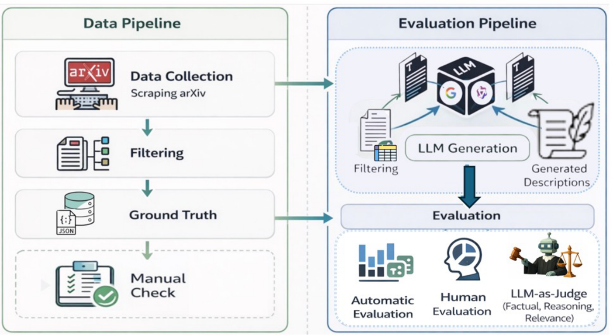
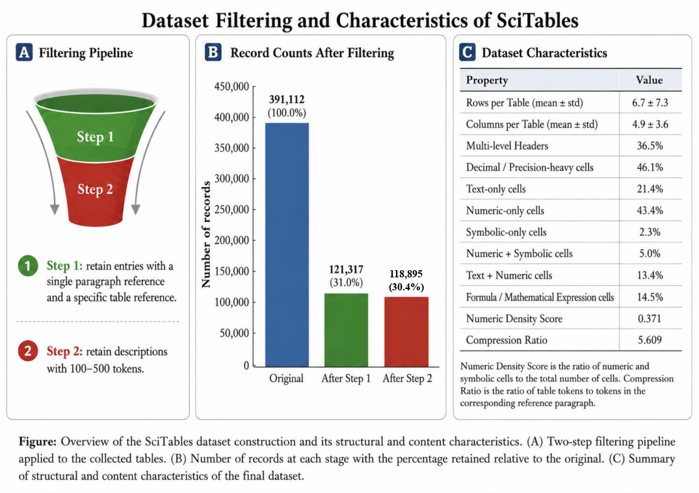
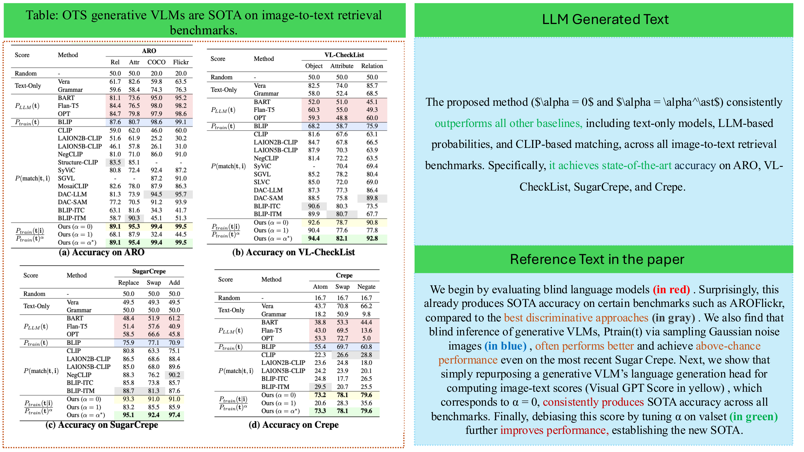
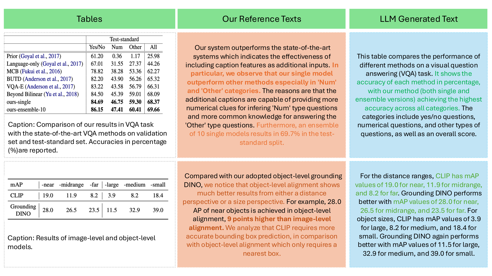

# SciTables : A Dataset and Evaluation Framework for Complex Table-to-Text Generation [Experiment, Analysis & Benchmark]
<p align="center">
  <a href="PAPER_LINK">Paper</a> •
  <a href="#dataset">Dataset</a> •
  <a href="#repository-structure">Code</a> •
  <a href="#citation">Citation</a> •
  <a href="LICENSE">License</a>
</p>

**SciTables** is an automated pipeline for constructing high-quality scientific table-to-text datasets from expert-authored scientific descriptions.

SciTables is built from Computer Science papers on arXiv and contains complex scientific tables paired with naturally occurring expert-written descriptions. It is designed to evaluate whether language models can generate faithful, concise, and reasoning-aware descriptions from structured scientific content.

<p align="center">
  
</p>

<p align="center">
  <b>Overview of the SciTables data construction and evaluation pipeline.</b>
</p>

## Why SciTables?

Existing table-to-text datasets often focus on open-domain or simplified tables. In contrast, scientific tables frequently contain dense numerical values, symbols, mathematical notation, model comparisons, and experimental results.

Generating descriptions for such tables requires models to perform content selection, comparison, aggregation, numerical reasoning, and faithful scientific communication. SciTables provides a realistic benchmark for evaluating these capabilities.

## Key Features

- Scientific table-to-text dataset from arXiv Computer Science papers
- Complex tables with numeric, symbolic, and mathematical content
- Naturally occurring expert-written descriptions
- Semi-automated data construction pipeline with quality control
- Evaluation with automatic metrics, human judgments, and LLM-as-a-judge assessment
- Analysis of how table complexity affects generation quality

## Dataset Construction

SciTables is constructed from LaTeX source files of arXiv Computer Science papers from 2017 to 2023. The pipeline consists of four main stages:

1. **Source collection:** collect LaTeX source files from arXiv papers.
2. **Table extraction:** extract candidate tables from LaTeX documents.
3. **Filtering and alignment:** select suitable tables and align them with explicitly referenced textual descriptions.
4. **Quality verification:** apply automatic and manual checks to improve dataset reliability.

<p align="center">
  
</p>

<p align="center">
  <b>Filtering process and dataset characteristics.</b>
</p>

## Examples

<p align="center">
  
</p>

<p align="center">
  
</p>

## Dataset

The dataset files and metadata are provided in this repository. Please see the `Data/` directory for dataset splits, metadata, and preprocessing outputs. See [Repository Structure](#repository-structure) for a full layout.

## Benchmarking

We evaluate multiple language models on scientific table-to-text generation, including LLaMA, Mistral, Gemma, Phi, and Aya.

Our experiments study:

- generation with and without table captions
- zero-shot, few-shot, and Chain-of-Thought prompting
- task-specific fine-tuning
- evaluation using original reference paragraphs and complete table-centric summaries
- the impact of table complexity on generation quality

## Evaluation

SciTables uses both automatic and holistic evaluation methods.

### Automatic Metrics

We report semantic, lexical, and distributional metrics:

- SBERT similarity
- BERTScore F1
- BLEU
- ROUGE-L
- METEOR
- KLLC divergence

KLLC denotes the KL divergence between the unigram distributions of the generated text and the reference caption. Lower KLLC is better.

### LLM-as-a-Judge Evaluation

Automatic similarity metrics may miss important scientific errors. A generated description can be close to the reference while still being numerically incorrect, factually inconsistent, or logically shallow.

To address this, we use an LLM-as-a-judge framework to evaluate generated descriptions across multiple dimensions, including factual accuracy, numerical faithfulness, comparative reasoning, trend analysis, content selection, and coherence.

## Results

We report representative results below. Full results, including caption-provided evaluation, prompting strategies, complete-summary evaluation, holistic judge scores, and structural complexity analysis, are available in the paper.

### Main Benchmark Results

The table below reports model performance in the **masked-caption setting**, where captions are hidden and models must generate descriptions from table content alone. We show the overall results across table sizes.

| Model | SBERT ↑ | BERTScore F1 ↑ | BLEU ↑ | ROUGE-L ↑ | METEOR ↑ | KLLC ↓ |
|---|---:|---:|---:|---:|---:|---:|
| LLaMA | 0.696&nbsp;±&nbsp;0.105 | 0.841&nbsp;±&nbsp;0.018 | 0.016&nbsp;±&nbsp;0.015 | 0.168&nbsp;±&nbsp;0.052 | 0.187&nbsp;±&nbsp;0.069 | 12.888&nbsp;±&nbsp;3.948 |
| Mistral | 0.744&nbsp;±&nbsp;0.131 | 0.840&nbsp;±&nbsp;0.021 | 0.021&nbsp;±&nbsp;0.022 | 0.180&nbsp;±&nbsp;0.062 | 0.206&nbsp;±&nbsp;0.083 | 8.733&nbsp;±&nbsp;5.471 |
| Gemma | 0.716&nbsp;±&nbsp;0.112 | 0.841&nbsp;±&nbsp;0.019 | 0.015&nbsp;±&nbsp;0.014 | 0.169&nbsp;±&nbsp;0.054 | 0.183&nbsp;±&nbsp;0.071 | 12.880&nbsp;±&nbsp;3.994 |
| Phi | 0.670&nbsp;±&nbsp;0.142 | 0.834&nbsp;±&nbsp;0.017 | 0.017&nbsp;±&nbsp;0.023 | 0.163&nbsp;±&nbsp;0.053 | 0.197&nbsp;±&nbsp;0.074 | 12.525&nbsp;±&nbsp;4.124 |
| Aya | 0.666&nbsp;±&nbsp;0.149 | 0.841&nbsp;±&nbsp;0.020 | 0.017&nbsp;±&nbsp;0.024 | 0.168&nbsp;±&nbsp;0.057 | 0.175&nbsp;±&nbsp;0.073 | 12.858&nbsp;±&nbsp;4.060 |

Mistral achieves the strongest overall SBERT score and the lowest KLLC, while most models show similar BERTScore F1 values. These results suggest that scientific table-to-text generation remains challenging when captions are unavailable.

### Effect of Task-Specific Fine-Tuning

We fine-tune Gemma using table-caption pairs from the SciTables training set and compare it with the base Gemma model on the held-out test set.

| Model | SBERT ↑ | BERTScore F1 ↑ | BLEU ↑ | ROUGE-L ↑ | METEOR ↑ | KLLC ↓ |
|---|---:|---:|---:|---:|---:|---:|
| Gemma | 0.716&nbsp;±&nbsp;0.112 | 0.841&nbsp;±&nbsp;0.019 | 0.015&nbsp;±&nbsp;0.014 | 0.169&nbsp;±&nbsp;0.054 | 0.183&nbsp;±&nbsp;0.071 | 12.880&nbsp;±&nbsp;3.994 |
| Gemma-FT-caption | 0.704&nbsp;±&nbsp;0.089 | 0.856&nbsp;±&nbsp;0.025 | 0.029&nbsp;±&nbsp;0.047 | 0.173&nbsp;±&nbsp;0.099 | 0.233&nbsp;±&nbsp;0.132 | 16.744&nbsp;±&nbsp;5.485 |

Fine-tuning improves BERTScore F1, BLEU, ROUGE-L, and METEOR, suggesting that task-specific adaptation helps the model better match scientific table descriptions. However, the increase in KLLC indicates that fine-tuning may also shift the lexical distribution away from the reference captions.

### Human–LLM Judge Agreement

We evaluate whether Qwen3.6-27B aligns with expert human ratings using a ten-dimensional rubric. Agreement is measured using Spearman’s ρ and Kendall’s τ.

| Setting | Avg. Spearman’s ρ ↑ | Avg. Kendall’s τ ↑ |
|---|---:|---:|
| Base | 0.889 | 0.841 |
| Fine-tuned | 0.961 | 0.942 |

Qwen3.6-27B shows strong agreement with human evaluators, supporting the use of LLM-as-a-judge evaluation as a scalable complement to expert assessment.

## Applications

SciTables can support research on:

- scientific table-to-text generation
- table understanding and reasoning
- evidence-grounded scientific summarization
- fact verification between tables and textual claims
- retrieval-augmented scientific assistants
- instruction tuning for scientific communication

## Repository Structure

| Path | Description |
|---|---|
| `Data/` | Dataset files, metadata, and splits |
| `Scripts/` | Data extraction, filtering, evaluation, and reproduction scripts |
| `assets/` | README figures and examples |

## Limitations

SciTables has several limitations. First, it is derived from Computer Science papers on arXiv, which may limit generalization to other scientific domains. Second, table-text alignment is inferred from document references and may occasionally miss broader contextual information. Third, reference descriptions reflect authors’ selective interpretations rather than exhaustive table summaries. Finally, while LLM-as-a-judge evaluation is scalable and shows strong agreement with human ratings, automated judges may still contain biases and cannot fully replace expert evaluation.

Future work will expand SciTables to additional scientific domains, incorporate richer document context, and explore more comprehensive evaluation frameworks.

## Citation

If you use SciTables, please cite our paper:

```bibtex
@inproceedings{scitables2026,
  title={A Dataset and Evaluation Framework for Complex Table-to-Text Generation [Experiment, Analysis & Benchmark]},
  author={...},
  booktitle={...},
  year={2026}
}
